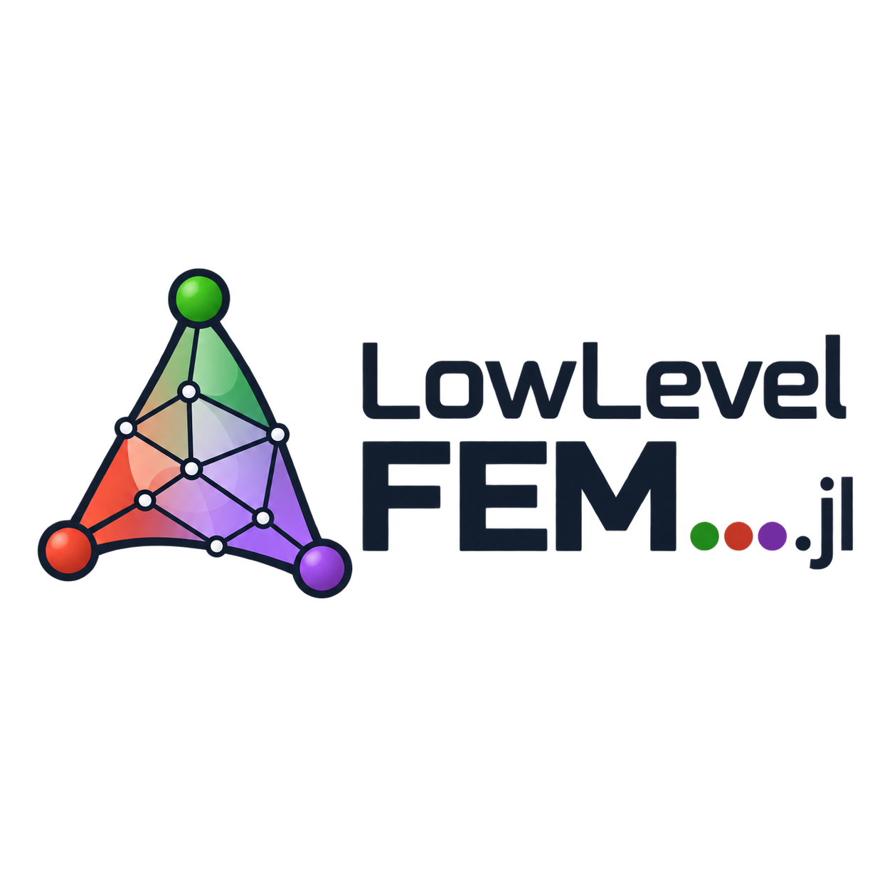

<p align="center">
  
</p>

[](https://github.com/perebalazs/LowLevelFEM.jl/actions/workflows/CI.yml?query=branch%3Amain)
[](https://perebalazs.github.io/LowLevelFEM.jl/dev)
[](https://perebalazs.github.io/LowLevelFEM.jl/stable)
[](https://codecov.io/gh/perebalazs/LowLevelFEM.jl)
[](https://joss.theoj.org/papers/b3ca075c57757edaacbfdf748e1cc6ee)
[](https://doi.org/10.5281/zenodo.17073982)
[](https://opensource.org/licenses/MIT)

# LowLevelFEM

LowLevelFEM is a Julia package for finite element analysis with an engineering-first workflow,
designed to assemble finite element operators explicitly at matrix and field level.  
It exposes each phase of the workflow as simple functions (mesh → matrices → loads/BCs → solve → postprocess → visualize), so you can customize, combine, or inspect any step **at matrix and field level**.  
Typical tasks such as strain energy or resultants are one-liners (for example, `U = q' * K * q / 2`).
The package is suitable not only for classical structural mechanics problems, but also for rapid assembly of general linear PDEs expressed in weak form.

“Low-level” here refers to direct access to finite element fields, operators, matrices, weak forms, and assembly results, rather than to explicit element-loop programming.

## Requirements

- Julia 1.x
- Gmsh C API is bundled via `gmsh_jll` and re-exported as `gmsh` from this package; no separate Gmsh.jl installation is required.

## Citation

If you use LowLevelFEM.jl in academic work, please cite the accompanying JOSS paper:

**Balázs Pere (2026).** *LowLevelFEM.jl: A lightweight finite element toolbox in Julia*, Journal of Open Source Software, 11(123), 10096, https://doi.org/10.21105/joss.10096

A BibTeX entry is provided in `CITATION.cff`.

## Capabilities

- Geometry and meshing: integrates with `gmsh` for 2D/3D geometry, meshing, and physical groups.
- Problem types: 3D solids, 2D plane stress/plane strain, axisymmetric; 3D/2D heat conduction and axisymmetric heat conduction.
- Elements and order: standard line/triangle/quad/tetra/hex/pyramid/wedge with Lagrange order up to 10.
- Materials: linear elastic (Hooke) and hyperelastic materials given by their free energy function. Direct input of 6×6 constitutive matrix is also possible.
- Matrices: stiffness `K`, mass `M` (lumped or consistent), proportional damping `C` (Rayleigh/Caughey),
  heat conduction/capacity, latent heat, convection matrices/vectors, and generic Poisson-type operators
  for scalar and vector fields.
- **Explicit matrices and fields:** unlike many high-level FEM packages, LowLevelFEM keeps global matrices and finite element fields accessible throughout the workflow, making every stage of the analysis transparent and customizable.
- **Operator-level programming:** implement, inspect and modify PDE operators, constitutive laws and weak-form formulations directly at matrix and field level.
- Loads and constraints: nodal and distributed loads on physical groups; function-based loads and temperature BCs; elastic supports; initial displacement/velocity/temperature.
- Thermal–structural coupling: thermal expansion, thermal stresses, and heat generated by elastic deformation.
- Solvers: static (direct and iterative solvers with arbitrary preconditioners) and transient dynamics (central difference and HHT-α from the Newmark family).
- Eigenproblems: modal analysis (frequencies and mode shapes, optionally prestressed) and linear buckling (critical factors and modes).
- Field operators and results: gradient/divergence/curl; stress/strain and heat flux as element or nodal fields; smoothing at nodes with field jumps; user-defined scalar/vector/tensor FE fields.
- Visualization and plots: Gmsh-based views for displacements, stresses, strains, heat flux, with animation for dynamics; plot results along user-defined paths; show results on surfaces.
- Coordinate systems: rotate nodal DOFs with constant or function-defined local coordinate systems (incl. curvilinear).
- Truss structures (static, transient, modal analysis)
- **Nonlinear solid mechanics (Total Lagrangian formulation)** Energy-based hyperelasticity with consistent stress and tangent operators, including geometric stiffness and follower loads for large-deformation problems.
- Weak-form assembly supports shared-memory multithreading. Bilinear forms use
  memory-efficient direct CSC assembly by default, while the triplet-based IJV
  method remains available as an option.
- Mixed-order formulations: algebraic p/(p−1) field reduction for Taylor–Hood-type and other mixed formulations, without changing the underlying Gmsh mesh.

## Installation

```julia
using Pkg
Pkg.add("LowLevelFEM")
```

## Quick Start

```julia
using LowLevelFEM

structured_rect_mesh() # uses Gmsh to create mesh

mat = Material("body", E=2e5, ν=0.3)
prob = Problem([mat], type=:PlaneStrain)  # :Solid, :PlaneStress, :AxiSymmetric, :HeatConduction, ...

bc    = displacementConstraint("left", ux=0, uy=0)
force = load("right", fy=-1)

u = solveDisplacement(prob, load=[force], support=[bc])
S = solveStress(u)

showDoFResults(u, visible=true)
showDoFResults(u, :ux)
showStressResults(S)
showStressResults(S, :sxy, name="Shear stress")

openPostProcessor()
```

Note: physical group names in your geometry (created in Gmsh) must match the strings used above (e.g., `"body"`, `"left"`, `"right"`).

### An alternative solution (instead of `u = ...`, `S = ...`)

```julia
K = stiffnessMatrix(prob)
f = loadVector(prob, [force])
u = solveDisplacement(K, f, support=[bc])

E = mat.E
ν = mat.ν

u = expandTo3D(u)

A = (u ∘ ∇ + ∇ ∘ u) / 2
I = TensorField(prob, "body", [1 0 0; 0 1 0; 0 0 1])
S = E / (1 + ν) * (A + ν / (1 - 2ν) * trace(A) * I)
```

### Operator-level weak-form assembly

For custom PDEs and multifield formulations, the finite element operator can
also be assembled directly from its weak form. Differential operators and
coefficient matrices remain explicit, allowing the formulation to be inspected,
modified and combined without implementing a dedicated solver.

```Julia
Pu = Problem([mat], type=:VectorField, dim=2, field=:u)

E = mat.E
ν = mat.ν

C = E / ((1 + ν) * (1 - 2ν)) * [
    1-ν  ν    0
    ν    1-ν  0
    0    0    (1-2ν)/2
]

K = ∫(SymGrad(Pu) ⋅ C ⋅ SymGrad(Pu), Ω="body")
f = ∫(Pu ⋅ [0, -1], Γ="right")
bc = BoundaryCondition("left", ux=0, uy=0)

u = solveField(K, f, support=[bc])
```

Bilinear forms are assembled directly into CSC sparse matrices by default. This
reduces temporary memory use and allows substantially larger problems than
triplet-based assembly. For repeated assembly on the same mesh and field pair,
the sparsity pattern can be built once and reused:

```julia
Kpattern = build_csc_pattern(Pu, Pu; Ω="body")

fill!(Kpattern.nzval, 0.0)
K = ∫(SymGrad(Pu) ⋅ C ⋅ SymGrad(Pu);
      Ω="body", csc_matrix=Kpattern)
```

The pattern must retain its structural zeros; do not call `dropzeros!` on it.
Before an independent reuse, reset its numerical values with `fill!` as shown
above. The previous triplet route remains available with `assembly=:ijv`.

The three examples above solve the same class of problem at different levels of
abstraction:

1. predefined engineering solver,
2. explicit matrices and finite element fields,
3. direct weak-form operator assembly.

The higher-level functions are convenience wrappers; the underlying matrices,
fields and operators remain accessible throughout the workflow.

### For interactive work with custom geometries

Gmsh can be launched directly from Julia.

```julia
openGeometry("test.geo")
openPreProcessor()
```

If `test.geo` already exists, it is opened for editing. Otherwise, `openGeometry` automatically creates a new geometry file, which can then be edited in Gmsh using `openPreProcessor()`.

This workflow is recommended for custom geometries and more advanced finite element models.

More end-to-end examples, tutorials and application notebooks are available in the
[examples](https://github.com/perebalazs/LowLevelFEM.jl/tree/main/examples) directory
and the online [documentation](https://perebalazs.github.io/LowLevelFEM.jl/stable/).

## Documentation

* Latest docs: [https://perebalazs.github.io/LowLevelFEM.jl/dev](https://perebalazs.github.io/LowLevelFEM.jl/dev)
* Stable docs: [https://perebalazs.github.io/LowLevelFEM.jl/stable](https://perebalazs.github.io/LowLevelFEM.jl/stable)

## Planned features

* Remote point constraint (like MPC in Ansys)
* Contact problems (penalty, Lagrange multiplier)

Any [suggestions](https://github.com/perebalazs/LowLevelFEM.jl/discussions) are welcome.
In case of any issue, please send a [bug report](https://github.com/perebalazs/LowLevelFEM.jl/issues).

## License

This project is licensed under the MIT License — see `LICENSE` for details.
