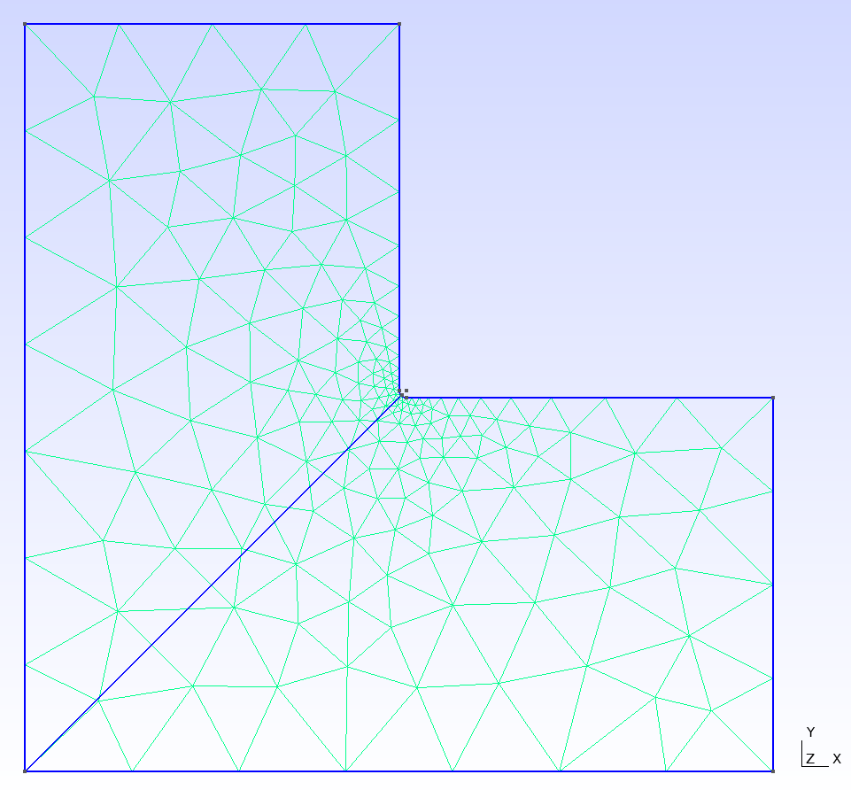
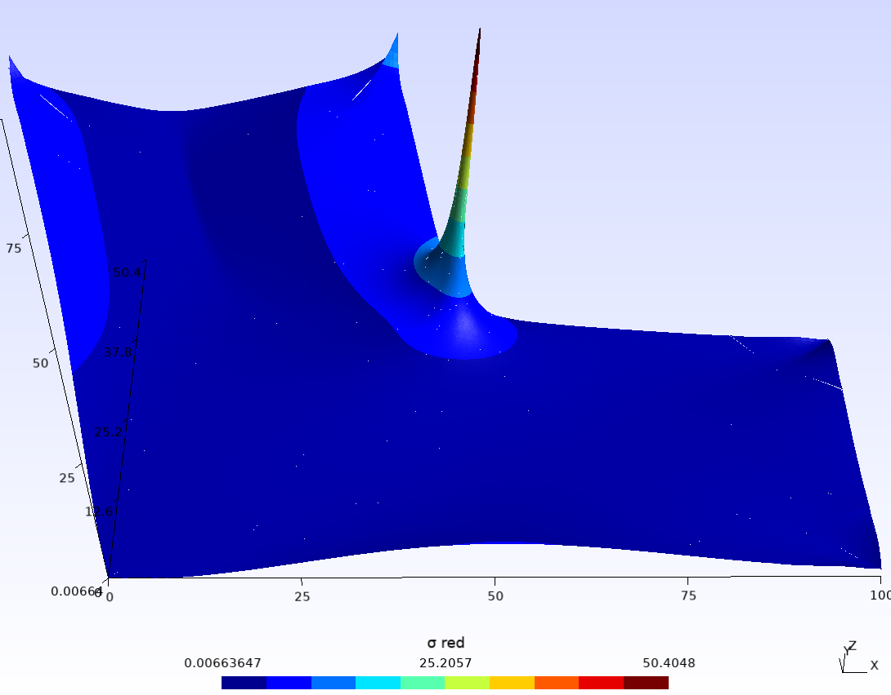

# Examples

## 2D Cantilever


cantilever2D.jl

```Julia
using LowLevelFEM

gmsh.initialize()

gmsh.open("cantilever2D.geo")
mat = material("body", E=2e5, ν=0.3)
problem = Problem([mat], type=:PlaneStress)

supp = displacementConstraint("supp", ux=0, uy=0)
load = load("load", fy=-1)

q = solveDisplacement(problem, [load], [supp])
S = solveStress(q)

u = showDoFResults(q, :uvec)
ux = showDoFResults(q, :ux)
uy = showDoFResults(q, :uy)

s = showStressResults(S, :s, visible=true, smooth=true)
sx = showStressResults(S, :sx, name="σx", visible=false, smooth=true)
sy = showStressResults(S, :sy, name="σy", visible=false, smooth=true)
sxy = showStressResults(S, :sxy, name="τxy", visible=false, smooth=true)

plotOnPath("path", sx, name="σx", visible=false)
plotOnPath("path", sxy, name="τxy", visible=false)
plotOnPath("path", ux, name="ux", visible=false)

gmsh.fltk.run()
gmsh.finalize()
```

cantilever2D.geo

```gmsh
SetFactory("OpenCASCADE");

Rectangle(1) = {0, 0, 0, 100, 10, 0};

Physical Curve("supp", 5) = {4};
Physical Curve("load", 6) = {2};
Physical Surface("body", 7) = {1};

Recombine Surface {1};

Transfinite Line {2,4} = 4;
Transfinite Line {1,3} = 31;
Transfinite Surface {1};

Mesh.ElementOrder = 3;

SetName "cantilever2D";
Mesh 2;

Point(5) = {10, 0, 0, 1.0};
Point(6) = {10, 10, 0, 1.0};
Line(5) = {5, 6};

Physical Curve("path", 8) = {5};
```

## 3D Cantilever


cantilever3D.jl

```Julia
using LowLevelFEM

gmsh.initialize()

gmsh.open("cantilever3D.geo")
mat = material("body", E=2e5, ν=0.3)
problem = Problem([mat])

supp = displacementConstraint("supp", ux=0, uy=0, uz=0)
ld = load("load", fy=-1)

K = stiffnessMatrix(problem)
f = loadVector(problem, [ld])

applyBoundaryConditions!(K, f, [supp])

q = solveDisplacement(K, f)
S = solveStress(q)

u = showDoFResults(q, :uvec, name="uvec", visible=false)
ux = showDoFResults(q, :ux, name="ux", visible=false)
uy = showDoFResults(q, :uy, name="uy", visible=false)
uz = showDoFResults(q, :uz, name="uz", visible=false)

s = showStressResults(S, :s, name="σ", visible=true, smooth=true)
sx = showStressResults(S, :sx, name="σx", visible=false, smooth=true)
sy = showStressResults(S, :sy, name="σy", visible=false, smooth=true)
sz = showStressResults(S, :sz, name="σz", visible=false, smooth=true)
sxy = showStressResults(S, :sxy, name="τxy", visible=false, smooth=true)
syz = showStressResults(S, :syz, name="τyz", visible=false, smooth=true)
szx = showStressResults(S, :szx, name="τzx", visible=false, smooth=true)

plotOnPath("path", sx, name="σx", visible=false)
plotOnPath("path", sxy, name="τxy", visible=false)
plotOnPath("path", ux, name="ux", visible=false)

gmsh.fltk.run()
gmsh.finalize()
```

cantilever3D.geo

```gmsh
SetFactory("OpenCASCADE");

Box(1) = {0, 0, 0, 100, 10, 10};

Physical Surface("supp", 13) = {1};
Physical Surface("load", 14) = {2};
Physical Volume("body", 15) = {1};

Recombine Surface {1:6};

Transfinite Line {1:8} = 4;
Transfinite Line {9:12} = 31;
Transfinite Surface {1:6};
Transfinite Volume {1};

Mesh.ElementOrder = 3;

SetName "cantilever3D";
Mesh 3;

Point(9) = {10, 0, 5, 1.0};
Point(10) = {10, 10, 5, 1.0};
Line(13) = {9, 10};

Physical Curve("path", 16) = {13};
```

## L-shaped plate







LshapedPlate.jl

```Julia
using LowLevelFEM

gmsh.initialize()

#gmsh.open("LshapedPlate.geo")
gmsh.open("LshapedPlate2.geo")

mat = material("body", E=2e5, ν=0.3)
problem = Problem([mat], type=:PlaneStress, thickness=1)

bc1 = displacementConstraint("fix", ux=0, uy=0)
ld1 = load("load", fy=-1)

K = stiffnessMatrix(problem)
f = loadVector(problem, [ld1])
applyBoundaryConditions!(K, f, [bc1])

q = solveDisplacement(K, f)
S = solveStress(q)

u = showDoFResults(q, :uvec, name="uvec", visible=false)
ux = showDoFResults(q, :ux, name="ux", visible=false)
uy = showDoFResults(q, :uy, name="uy", visible=false)
uz = showDoFResults(q, :uz, name="uz", visible=false)
s = showStressResults(S, :s, name="σ red", visible=false, smooth=false)
ss = showStressResults(S, :s, name="σ red smooth", visible=true, smooth=true)
sx = showStressResults(S, :sx, name="σx", visible=false, smooth=true)
sy = showStressResults(S, :sy, name="σy", visible=false, smooth=true)
sz = showStressResults(S, :sz, name="σz", visible=false, smooth=true)
sxy = showStressResults(S, :sxy, name="τxy", visible=false, smooth=true)
syz = showStressResults(S, :syz, name="τyz", visible=false, smooth=true)
szx = showStressResults(S, :szx, name="τzx", visible=false, smooth=true)

plotOnPath("path", s, name="σred", visible=false)

gmsh.fltk.run()
gmsh.finalize()
```

LshapedPlate.geo

```gmsh
Point(1) = {0, 0, 0, 15.0};
Point(2) = {100, 0, 0, 15.0};
Point(3) = {100, 50, 0, 15.0};
Point(4) = {50, 50, 0, 0.5};
Point(5) = {50, 100, 0, 15.0};
Point(6) = {0, 100, 0, 15.0};
Line(1) = {1, 2};
Line(2) = {2, 3};
Line(3) = {3, 4};
Line(4) = {4, 5};
Line(5) = {5, 6};
Line(6) = {6, 1};
Curve Loop(1) = {6, 1, 2, 3, 4, 5};
Plane Surface(1) = {1};

Physical Curve("fix", 7) = {5};
Physical Curve("load", 8) = {2};
Physical Surface("body", 11) = {1};

SetName "Lshape";

Mesh.ElementOrder = 4;
Mesh.HighOrderOptimize = 1;
Mesh 2;

Point(7) = {0, 0, 0, 1.0};
Point(8) = {50, 50, 0, 1.0};
Line(7) = {7, 8};

Physical Curve("path", 9) = {7};
```

LshapedPlate2.geo

```gmsh
R=1;

Point(1) = {0, 0, 0, 15.0};
Point(2) = {100, 0, 0, 15.0};
Point(3) = {100, 50, 0, 15.0};
Point(4) = {50+R, 50, 0, R/1.6};
Point(5) = {50, 50+R, 0, R/1.6};
Point(6) = {50, 100, 0, 15.0};
Point(7) = {0, 100, 0, 15.0};
Point(8) = {50+R, 50+R, 0, 0.0};
Line(1) = {1, 2};
Line(2) = {2, 3};
Line(3) = {3, 4};
Circle(4) = {4, 8, 5};
Line(5) = {5, 6};
Line(6) = {6, 7};
Line(7) = {7, 1};
Curve Loop(1) = {1, 2, 3, 4, 5, 6, 7};
Plane Surface(1) = {1};

Physical Curve("fix", 8) = {6};
Physical Curve("load", 9) = {2};
Physical Surface("body", 11) = {1};

SetName "Lshape";
Mesh.ElementOrder = 4;
Mesh.HighOrderOptimize = 1;
Mesh 2;

Point(9) = {0, 0, 0, 1.0};
Point(10) = {50+0.415*R, 50+0.415*R, 0, 1.0};
Line(8) = {9, 10};

Physical Curve("path", 10) = {8};
```

## Wave propagation in a plate


wavePropagation.jl

```Julia
using LowLevelFEM

gmsh.initialize()

E = 2e5
ν = 0.3
ρ = 7.85e-9
thick = 1
height = 10
base = 100
elemSize = 2 #22

approxOrder = 2
internalNodes = true
quadElements = true

gmsh.model.add("rectangle")

p1 = gmsh.model.occ.addPoint(0, 0, 0)
p2 = gmsh.model.occ.addPoint(base, 0, 0)
p3 = gmsh.model.occ.addPoint(base, height, 0)
p4 = gmsh.model.occ.addPoint(0, height, 0)

l1 = gmsh.model.occ.addLine(p1, p2)
l2 = gmsh.model.occ.addLine(p2, p3)
l3 = gmsh.model.occ.addLine(p3, p4)
l4 = gmsh.model.occ.addLine(p4, p1)

cl1 = gmsh.model.occ.addCurveLoop([l1, l2, l3, l4])

l5 = gmsh.model.occ.addCircle(base / 2, height / 2, 0, min(base, height) / 4)
cl2 = gmsh.model.occ.addCurveLoop([l5])

sf1 = gmsh.model.occ.addPlaneSurface([cl1, cl2])

gmsh.model.occ.synchronize()

phg = gmsh.model.addPhysicalGroup(1, [l2])
gmsh.model.setPhysicalName(1, phg, "supp")
phg = gmsh.model.addPhysicalGroup(1, [l4])
gmsh.model.setPhysicalName(1, phg, "load")
phg = gmsh.model.addPhysicalGroup(2, [sf1])
gmsh.model.setPhysicalName(2, phg, "body")

generateMesh(sf1, elemSize, approxOrder=approxOrder, algorithm=6, quadrangle=quadElements, internalNodes=internalNodes)

mat = material("body", E=E, ν=ν)
problem = Problem([mat], type=:PlaneStress, thickness=thick)

supp = displacementConstraint("supp", ux=0, uy=0)
ld = load("load", fx=1, fy=0)

gmsh.option.setNumber("Mesh.Lines", 0)

K = stiffnessMatrix(problem)
f = loadVector(problem, [ld])
M = massMatrix(problem)
C = 4e-3 * K

applyBoundaryConditions!(K, M, C, f, [supp])

Tₘᵢₙ = smallestPeriodTime(K, M)
q = solveDisplacement(K, f)

dof, dof = size(K)
u0 = zeros(dof)
v0 = zeros(dof)
initialDisplacement!("supp", u0, ux=0)
initialVelocity!("body", v0, vx=1000)
initialVelocity!("supp", v0, vx=0)
f = zeros(dof)

E = problem.material[1].E
ρ = problem.material[1].ρ
c = √(E / ρ)
ξₘₐₓ = 1e-1
β = ξₘₐₓ * Tₘᵢₙ / π
C = β * K
u, v, t = CDM(K, M, C, f, u0, v0, base / c * 2, Tₘᵢₙ / π * (√(1 + ξₘₐₓ^2) - ξₘₐₓ) * 1.0)

S = solveStress(q)

uvec = showDoFResults(q, :uvec, name="uvec", visible=false)
ux = showDoFResults(q, :ux, name="ux", visible=false)
uy = showDoFResults(q, :uy, name="uy", visible=false)
uz = showDoFResults(q, :uz, name="uz", visible=false)
s = showStressResults(S, :s, name="σ", visible=false, smooth=true)
sx = showStressResults(S, :sx, name="σx", visible=false, smooth=true)
sy = showStressResults(S, :sy, name="σy", visible=false, smooth=true)
sz = showStressResults(S, :sz, name="σz", visible=false, smooth=true)
sxy = showStressResults(S, :sxy, name="τxy", visible=false, smooth=true)
syz = showStressResults(S, :syz, name="τyz", visible=false, smooth=true)
szx = showStressResults(S, :szx, name="τzx", visible=false, smooth=true)

# Show velocity time history as a VectorField with time vector t
vVF = VectorField([], v, t, [], length(t), :u2D, problem)
vvec = showDoFResults(vVF, :uvec, name="v(t)", visible=true)
gmsh.view.option.setNumber(vvec, "NormalRaise", 0.03)

sts = ceil(Int64, (base / c * 2) / 6 / (Tₘᵢₙ / π * (√(1 + ξₘₐₓ^2) - ξₘₐₓ)))
display(sts)
uVF_sts = VectorField([], u[:, sts:sts], [t[sts]], [], 1, :u2D, problem)
Sp = solveStress(uVF_sts)
sp = showStressResults(Sp, :s, name="σ at t", visible=false, smooth=false)

uVF_anim = VectorField([], u[:, 1:sts], t[1:sts], [], sts, :u2D, problem)
Sanim = solveStress(uVF_anim)
sanim = showStressResults(Sanim, :s, name="σ anim", visible=false, smooth=false)

gmsh.fltk.run()
gmsh.finalize()
```

For more examples see [examples on GitHub](https://github.com/perebalazs/LowLevelFEM.jl/tree/main/examples)

---

## 2D Heat Conduction (steady state)

```Julia
using LowLevelFEM

gmsh.initialize()

# Problem and BCs
mat = material("body", k=45.0)
problem = Problem([mat], type=:PlaneHeatConduction, thickness=1.0)

bc_hot = temperatureConstraint("hot", T=100.0)
bc_cold = temperatureConstraint("cold", T=0.0)

# Assemble and solve K*T = q with Dirichlet BCs
Kth = heatConductionMatrix(problem)
qth = heatFluxVector(problem, [])
applyBoundaryConditions!(Kth, qth, [bc_hot, bc_cold])
T = solveTemperature(Kth, qth)

# Postprocess: temperature and heat flux
showDoFResults(T, :T, name="T", visible=true)
qflux = solveHeatFlux(T)
showHeatFluxResults(qflux, :qvec, name="q", visible=false, smooth=true)

openPostProcessor()
gmsh.finalize()
```

## 2D Heat Conduction with Convection

```Julia
using LowLevelFEM

gmsh.initialize()

# Heat problem and BCs
matT = material("body", k=45.0)
probT = Problem([matT], type=:PlaneHeatConduction, thickness=1.0)

bc_hot = temperatureConstraint("hot", T=100.0)
hcv = heatConvection("conv", h=15.0, Tₐ=20.0)

Kth = heatConductionMatrix(probT)
qth = heatFluxVector(probT, [])
applyHeatConvection!(Kth, qth, [hcv])
applyBoundaryConditions!(Kth, qth, [bc_hot])
T = solveTemperature(Kth, qth)

showDoFResults(T, :T, name="T", visible=true)
qflux = solveHeatFlux(T)
showHeatFluxResults(qflux, :qvec, name="q", visible=false, smooth=true)

openPostProcessor()
gmsh.finalize()
```

## Thermo‑Mechanical Coupling (Plane Stress)

```Julia
using LowLevelFEM

gmsh.initialize()

# 1) Heat problem to compute T(x)
matT = material("body", k=45.0)
probT = Problem([matT], type=:PlaneHeatConduction, thickness=1.0)
bc_hot = temperatureConstraint("hot", T=100.0)
hcv = heatConvection("conv", h=15.0, Tₐ=20.0)
Kth = heatConductionMatrix(probT)
qth = heatFluxVector(probT, [])
applyHeatConvection!(Kth, qth, [hcv])
applyBoundaryConditions!(Kth, qth, [bc_hot])
T = solveTemperature(Kth, qth)

# 2) Elastic problem with thermal load
matE = material("body", E=210e3, ν=0.3, α=1.2e-5)
probE = Problem([matE], type=:PlaneStress, thickness=1.0)
K = stiffnessMatrix(probE)
fth = thermalLoadVector(probE, T)  # from temperature field
bc_fix = displacementConstraint("hot", ux=0.0, uy=0.0)
applyBoundaryConditions!(K, fth, [bc_fix])
q = solveDisplacement(K, fth)
S = solveStress(q)

showDoFResults(q, :uvec, name="u", visible=false)
showStressResults(S, :s, name="σ", visible=true, smooth=true)

openPostProcessor()
gmsh.finalize()
```
