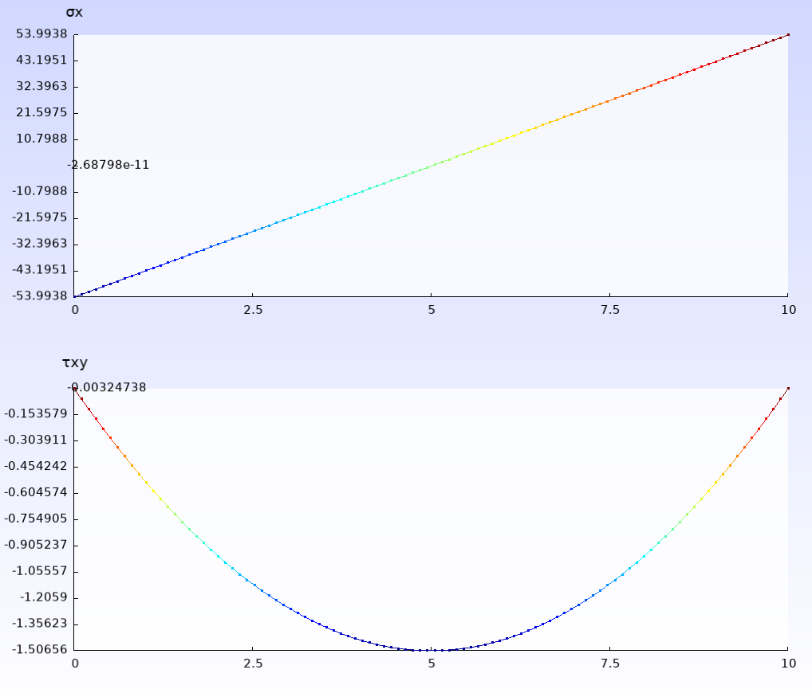

# Examples

## 2D Cantilever




cantilever2D.jl
```Julia
import LowLevelFEM as FEM
using LowLevelFEM

gmsh.initialize()

gmsh.open("cantilever2D.geo")
mat = FEM.material("body", E=2.e5, ν=0.3)
problem = FEM.Problem([mat], type=:PlaneStress)

supp = FEM.displacementConstraint("supp", ux=0, uy=0)
load = FEM.load("load", fy=-1)

q = FEM.solveDisplacement(problem, [load], [supp)
S = FEM.solveStress(problem, q)

u = FEM.showDoFResults(problem, q, :uvec)
ux = FEM.showDoFResults(problem, q, :ux)
uy = FEM.showDoFResults(problem, q, :uy)

s = FEM.showStressResults(problem, S, :s, visible=true, smooth=true)
sx = FEM.showStressResults(problem, S, :sx, name="σx", visible=false, smooth=true)
sy = FEM.showStressResults(problem, S, :sy, name="σy", visible=false, smooth=true)
sxy = FEM.showStressResults(problem, S, :sxy, name="τxy", visible=false, smooth=true)

FEM.plotOnPath(problem, "path", sx, name="σx", visible=false);
FEM.plotOnPath(problem, "path", sxy, name="τxy", visible=false);
FEM.plotOnPath(problem, "path", ux, name="ux", visible=false);

gmsh.fltk.run()
gmsh.finalize()
```

cantilever2D.geo
```gmsh
SetFactory("OpenCASCADE");

Rectangle(1) = {0, 0, 0, 100, 10, 0};

Physical Curve("supp", 5) = {4};
Physical Curve("load", 6) = {2};
Physical Surface("body", 7) = {1};

Recombine Surface {1};

Transfinite Line {2,4} = 4;
Transfinite Line {1,3} = 31;
Transfinite Surface {1};

Mesh.ElementOrder = 3;

SetName "cantilever2D";
Mesh 2;

Point(5) = {10, 0, 0, 1.0};
Point(6) = {10, 10, 0, 1.0};
Line(5) = {5, 6};

Physical Curve("path", 8) = {5};
```

## 3D Cantilever


cantilever3D.jl
```Julia
import LowLevelFEM as FEM
using LowLevelFEM

gmsh.initialize()

gmsh.open("cantilever3D.geo")
mat = FEM.material("body", E=2.e5, ν=0.3)
problem = FEM.Problem([mat])

supp = FEM.displacementConstraint("supp", ux=0, uy=0, uz=0)
load = FEM.load("load", fy=-1)

K = FEM.stiffnessMatrix(problem)
f = FEM.loadVector(problem, [load])

FEM.applyBoundaryConditions!(problem, K, f, [supp])

q = FEM.solveDisplacement(K, f)
S = FEM.solveStress(problem, q)

u = FEM.showDoFResults(problem, q, :uvec, name="uvec", visible=false)
ux = FEM.showDoFResults(problem, q, :ux, name="ux", visible=false)
uy = FEM.showDoFResults(problem, q, :uy, name="uy", visible=false)
uz = FEM.showDoFResults(problem, q, :uz, name="uz", visible=false)

s = FEM.showStressResults(problem, S, :s, name="σ", visible=true, smooth=true)
sx = FEM.showStressResults(problem, S, :sx, name="σx", visible=false, smooth=true)
sy = FEM.showStressResults(problem, S, :sy, name="σy", visible=false, smooth=true)
sz = FEM.showStressResults(problem, S, :sz, name="σz", visible=false, smooth=true)
sxy = FEM.showStressResults(problem, S, :sxy, name="τxy", visible=false, smooth=true)
syz = FEM.showStressResults(problem, S, :syz, name="τyz", visible=false, smooth=true)
szx = FEM.showStressResults(problem, S, :szx, name="τzx", visible=false, smooth=true)

FEM.plotOnPath(problem, "path", sx, name="σx", visible=false);
FEM.plotOnPath(problem, "path", sxy, name="τxy", visible=false);
FEM.plotOnPath(problem, "path", ux, name="ux", visible=false);

gmsh.fltk.run()
gmsh.finalize()
```

cantilever3D.geo
```gmsh
SetFactory("OpenCASCADE");

Box(1) = {0, 0, 0, 100, 10, 10};

Physical Surface("supp", 13) = {1};
Physical Surface("load", 14) = {2};
Physical Volume("body", 15) = {1};

Recombine Surface {1:6};

Transfinite Line {1:8} = 4;
Transfinite Line {9:12} = 31;
Transfinite Surface {1:6};
Transfinite Volume {1};

Mesh.ElementOrder = 3;

SetName "cantilever3D";
Mesh 3;

Point(9) = {10, 0, 5, 1.0};
Point(10) = {10, 10, 5, 1.0};
Line(13) = {9, 10};

Physical Curve("path", 16) = {13};
```

## L-shaped plate


LshapedPlate.jl
```Julia
import LowLevelFEM as FEM
using LowLevelFEM

gmsh.initialize()

#gmsh.open("LshapedPlate.geo")
gmsh.open("LshapedPlate2.geo")

mat = FEM.material("body", E=2.e5, ν=0.3)
problem = FEM.Problem([mat], type=:PlaneStress, thickness=1)

bc1 = FEM.displacementConstraint("fix", ux=0, uy=0)
ld1 = FEM.load("load", fy=-1)

K = FEM.stiffnessMatrix(problem)
f = FEM.loadVector(problem, [ld1])
FEM.applyBoundaryConditions!(problem, K, f, [bc1])

q = FEM.solveDisplacement(K, f)
S = FEM.solveStress(problem, q)

u = FEM.showDoFResults(problem, q, :uvec, name="uvec", visible=false)
ux = FEM.showDoFResults(problem, q, :ux, name="ux", visible=false)
uy = FEM.showDoFResults(problem, q, :uy, name="uy", visible=false)
uz = FEM.showDoFResults(problem, q, :uz, name="uz", visible=false)
s = FEM.showStressResults(problem, S, :s, name="σ red", visible=false, smooth=false)
ss = FEM.showStressResults(problem, S, :s, name="σ red smooth", visible=true, smooth=true)
sx = FEM.showStressResults(problem, S, :sx, name="σx", visible=false, smooth=true)
sy = FEM.showStressResults(problem, S, :sy, name="σy", visible=false, smooth=true)
sz = FEM.showStressResults(problem, S, :sz, name="σz", visible=false, smooth=true)
sxy = FEM.showStressResults(problem, S, :sxy, name="τxy", visible=false, smooth=true)
syz = FEM.showStressResults(problem, S, :syz, name="τyz", visible=false, smooth=true)
szx = FEM.showStressResults(problem, S, :szx, name="τzx", visible=false, smooth=true)

FEM.plotOnPath(problem, "path", s, name="σred", visible=false);

gmsh.fltk.run()
gmsh.finalize()
```

LshapedPlate.geo
```gmsh
Point(1) = {0, 0, 0, 15.0};
Point(2) = {100, 0, 0, 15.0};
Point(3) = {100, 50, 0, 15.0};
Point(4) = {50, 50, 0, 0.5};
Point(5) = {50, 100, 0, 15.0};
Point(6) = {0, 100, 0, 15.0};
Line(1) = {1, 2};
Line(2) = {2, 3};
Line(3) = {3, 4};
Line(4) = {4, 5};
Line(5) = {5, 6};
Line(6) = {6, 1};
Curve Loop(1) = {6, 1, 2, 3, 4, 5};
Plane Surface(1) = {1};

Physical Curve("fix", 7) = {5};
Physical Curve("load", 8) = {2};
Physical Surface("body", 11) = {1};

SetName "Lshape";

Mesh.ElementOrder = 4;
Mesh.HighOrderOptimize = 1;
Mesh 2;

Point(7) = {0, 0, 0, 1.0};
Point(8) = {50, 50, 0, 1.0};
Line(7) = {7, 8};

Physical Curve("path", 9) = {7};
```

LshapedPlate2.geo
```gmsh
R=1;

Point(1) = {0, 0, 0, 15.0};
Point(2) = {100, 0, 0, 15.0};
Point(3) = {100, 50, 0, 15.0};
Point(4) = {50+R, 50, 0, R/1.6};
Point(5) = {50, 50+R, 0, R/1.6};
Point(6) = {50, 100, 0, 15.0};
Point(7) = {0, 100, 0, 15.0};
Point(8) = {50+R, 50+R, 0, 0.0};
Line(1) = {1, 2};
Line(2) = {2, 3};
Line(3) = {3, 4};
Circle(4) = {4, 8, 5};
Line(5) = {5, 6};
Line(6) = {6, 7};
Line(7) = {7, 1};
Curve Loop(1) = {1, 2, 3, 4, 5, 6, 7};
Plane Surface(1) = {1};

Physical Curve("fix", 8) = {6};
Physical Curve("load", 9) = {2};
Physical Surface("body", 11) = {1};

SetName "Lshape";
Mesh.ElementOrder = 4;
Mesh.HighOrderOptimize = 1;
Mesh 2;

Point(9) = {0, 0, 0, 1.0};
Point(10) = {50+0.415*R, 50+0.415*R, 0, 1.0};
Line(8) = {9, 10};

Physical Curve("path", 10) = {8};
```

## Wave propagation in a plate


wavePropagation.jl
```Julia
import LowLevelFEM as FEM
using LowLevelFEM

gmsh.initialize()

E = 2e5
ν = 0.3
ρ = 7.85e-9
thick = 1
height = 10
base = 100
elemSize = 2 #22

approxOrder = 2
internalNodes = true
quadElements = true

gmsh.model.add("rectangle")

p1 = gmsh.model.occ.addPoint(0, 0, 0)
p2 = gmsh.model.occ.addPoint(base, 0, 0)
p3 = gmsh.model.occ.addPoint(base, height, 0)
p4 = gmsh.model.occ.addPoint(0, height, 0)

l1 = gmsh.model.occ.addLine(p1, p2)
l2 = gmsh.model.occ.addLine(p2, p3)
l3 = gmsh.model.occ.addLine(p3, p4)
l4 = gmsh.model.occ.addLine(p4, p1)

cl1 = gmsh.model.occ.addCurveLoop([l1, l2, l3, l4])

l5 = gmsh.model.occ.addCircle(base / 2, height / 2, 0, min(base, height) / 4)
cl2 = gmsh.model.occ.addCurveLoop([l5])

sf1 = gmsh.model.occ.addPlaneSurface([cl1, cl2])

gmsh.model.occ.synchronize()

phg = gmsh.model.addPhysicalGroup(1, [l2])
gmsh.model.setPhysicalName(1, phg, "supp")
phg = gmsh.model.addPhysicalGroup(1, [l4])
gmsh.model.setPhysicalName(1, phg, "load")
phg = gmsh.model.addPhysicalGroup(2, [sf1])
gmsh.model.setPhysicalName(2, phg, "body")

FEM.generateMesh(sf1, elemSize, approxOrder=approxOrder, algorithm=6, quadrangle=quadElements, internalNodes=internalNodes)

mat = FEM.material("body", E=E, ν=ν)
problem = FEM.Problem([mat], type=:PlaneStress, thickness=thick)

supp = FEM.displacementConstraint("supp", ux=0, uy=0)
load = FEM.load("load", fx=1, fy=0)

gmsh.option.setNumber("Mesh.Lines", 0)

K = FEM.stiffnessMatrix(problem)
f = FEM.loadVector(problem, [load])
M = FEM.massMatrix(problem)
C = 4e-3 * K

FEM.applyBoundaryConditions!(problem, K, M, C, f, [supp]);

Tₘᵢₙ = FEM.smallestPeriodTime(K, M)
q = FEM.solveDisplacement(K, f)

dof, dof = size(K)
u0 = zeros(dof)
v0 = zeros(dof)
FEM.initialDisplacement!(problem, "supp", u0, ux=0)
FEM.initialVelocity!(problem, "body", v0, vx=1000)
FEM.initialVelocity!(problem, "supp", v0, vx=0)
f = zeros(dof)

E = problem.material[1][2]
ρ = problem.material[1][4]
c = √(E / ρ)
ξₘₐₓ = 1e-1
β = ξₘₐₓ * Tₘᵢₙ / π
C = β * K
u, v, t = FEM.CDM(K, M, C, f, u0, v0, base / c * 2, Tₘᵢₙ / π * (√(1 + ξₘₐₓ^2) - ξₘₐₓ) * 1.0)

S = FEM.solveStress(problem, q)

uvec = FEM.showDoFResults(problem, q, :uvec, name="uvec", visible=false)
ux = FEM.showDoFResults(problem, q, :ux, name="ux", visible=false)
uy = FEM.showDoFResults(problem, q, :uy, name="uy", visible=false)
uz = FEM.showDoFResults(problem, q, :uz, name="uz", visible=false)
s = FEM.showStressResults(problem, S, :s, name="σ", visible=false, smooth=true)
sx = FEM.showStressResults(problem, S, :sx, name="σx", visible=false, smooth=true)
sy = FEM.showStressResults(problem, S, :sy, name="σy", visible=false, smooth=true)
sz = FEM.showStressResults(problem, S, :sz, name="σz", visible=false, smooth=true)
sxy = FEM.showStressResults(problem, S, :sxy, name="τxy", visible=false, smooth=true)
syz = FEM.showStressResults(problem, S, :syz, name="τyz", visible=false, smooth=true)
szx = FEM.showStressResults(problem, S, :szx, name="τzx", visible=false, smooth=true)
vvec = FEM.showDoFResults(problem, v, t=t, :uvec, name="v(t)", visible=true)
gmsh.view.option.setNumber(vvec, "NormalRaise", 0.03)

sts = ceil(Int64, (base / c * 2) / 6 / (Tₘᵢₙ / π * (√(1 + ξₘₐₓ^2) - ξₘₐₓ)))
display(sts)
Sp = FEM.solveStress(problem, u[:, sts])
sp = FEM.showStressResults(problem, Sp, :s, name="σ at t", visible=false, smooth=false);

Sanim = FEM.solveStress(problem, u[:, 1:sts])
sanim = FEM.showStressResults(problem, Sanim, :s, t=t[1:sts], name="σ anim", visible=false, smooth=false);

gmsh.fltk.run()
gmsh.finalize()
```

For more examples see [examples on GitHub](https://github.com/perebalazs/LowLevelFEM.jl/tree/main/examples)

---

